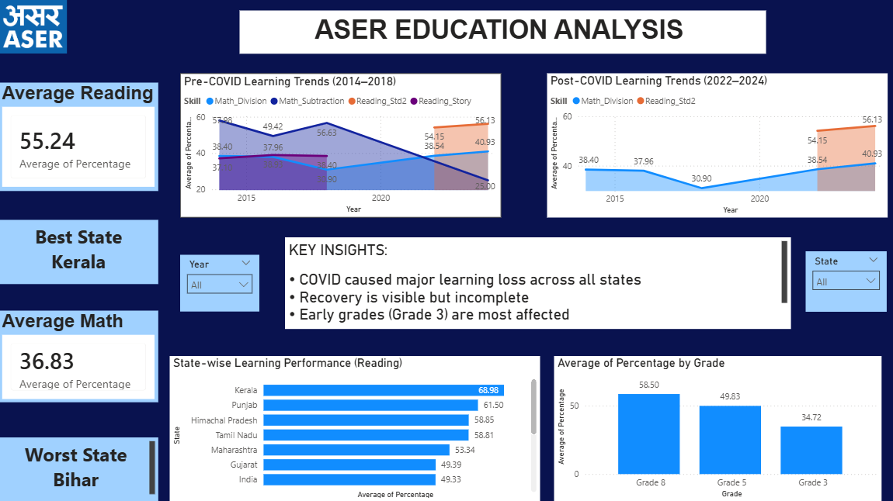

# 📊 ASER Education Analysis (Power BI Project)

## 🎯 Overview
This project analyzes ASER (Annual Status of Education Report) data to study learning trends across India, focusing on pre- and post-COVID impact and identifying foundational learning gaps.

---

## 📁 Dataset

- The dataset is stored in **aser_education.csv**
- All years (2014, 2016, 2018, 2022, 2024) are combined into a single structured dataset

### 🔹 Master Sheet
- Data is organized in a **Master_Data sheet**
- This sheet contains cleaned and transformed data ready for analysis

### 🔹 Columns Used:
- Year  
- State  
- Grade  
- Skill  
- Percentage  

---

## 🧹 Data Cleaning & Preparation

Data was cleaned in Excel before importing into Power BI:

- Standardized column names across all years  
- Added a **Year column** for time analysis  
- Cleaned inconsistent state and skill names  
- Removed missing and invalid values  
- Converted data into **long format**  
- Combined all sheets into a single **Master_Data sheet**  

---

## 🛠 Tools Used

- **Excel** → Data cleaning & preprocessing  
- **Power BI** → Dashboard creation & visualization  

---

## 📊 KPI Metrics

The following KPIs are used in the dashboard:

- **Average Reading Score**  
- **Average Math Score**  
- **Best Performing State**  
- **Worst Performing State**  
- **Post-COVID Recovery Indicator (2022 → 2024)**  

These KPIs help summarize overall performance and highlight key insights quickly.

---

## 📈 Dashboard Features

- 📉 Pre-COVID Learning Trends (2014–2018)  
- 📈 Post-COVID Learning Trends (2022–2024)  
- 🗺 State-wise Performance Comparison  
- 🎓 Grade-wise Performance Analysis  
- 🎯 Interactive filters (Year, State)  
- 📊 KPI Cards for quick insights  

---

## 🔍 Key Insights

- Significant learning drop observed in **2022 due to COVID**  
- **Partial recovery** seen in 2024  
- **Math performance is consistently lower** than reading  
- **Early grades (Grade 3)** show the weakest performance  
- Strong variation exists across states  

---

## 🚀 Problem Statement

There is no real-time system to track foundational learning gaps, leading to long-term educational deficiencies.

---

## 💡 Proposed Solution

A **data-driven learning analytics platform** that:

- Continuously tracks student performance  
- Identifies weak students early  
- Provides personalized learning recommendations using AI  
- Helps educators take timely interventions  

---

## 📷 Dashboard Preview

---

## 👨‍💻 Author

**Vinay**
